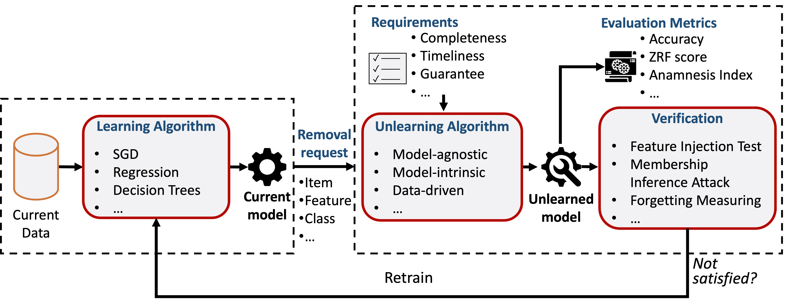
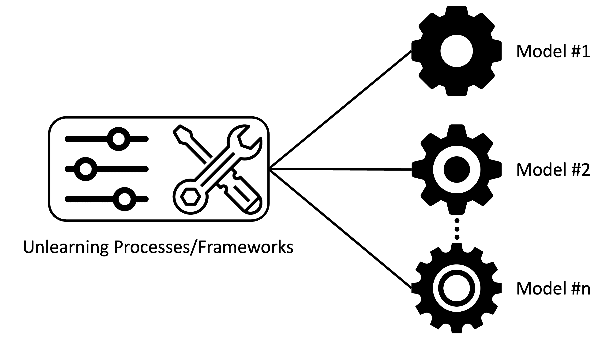
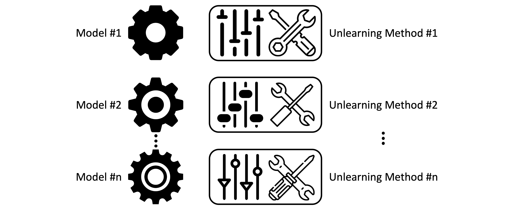
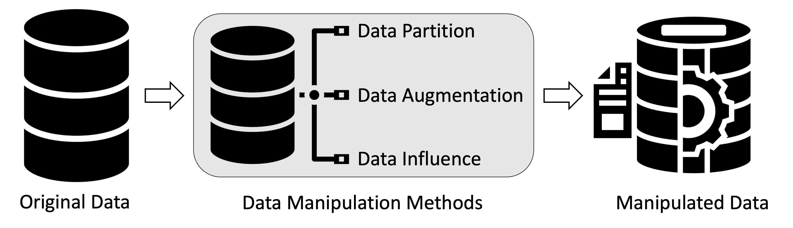

# Awesome Machine Unlearning

[](https://awesome.re)
[](https://arxiv.org/abs/2209.02299)
[](https://www.kaggle.com/code/tamlhp/machine-unlearning-the-right-to-be-forgotten/)
[](https://awesome-machine-unlearning.github.io/)

[](https://hits.seeyoufarm.com)


A collection of academic articles, published methodology, and datasets on the subject of **machine unlearning**.

- [Awesome-Machine-Unlearning](#awesome-machine-unlearning)
  - [ A Framework of Machine Unlearning](#a-framework-of-machine-unlearning)
  - [Surveys](#existing-surveys)
  - [Model-agnostic](#model-agnostic-approaches)
  - [Model-intrinsic](#model-intrinsic-approaches)
  - [Data-Driven](#data-driven-approaches)
  - [Datasets](#datasets)
    - [Type: Image](#type-image)
    - [Type: Tabular](#type-tabular)
    - [Type: Text](#type-text)
    - [Type: Sequence](#type-sequence)
    - [Type: Graph](#type-graph)
  - [Evaluation Metrics](#evaluation-metrics)

A sortable version is available here: https://awesome-machine-unlearning.github.io/

Please read and cite our paper: [](https://arxiv.org/abs/2209.02299)

>Nguyen, T.T., Huynh, T.T., Nguyen, P.L., Liew, A.W.C., Yin, H. and Nguyen, Q.V.H., 2022. A Survey of Machine Unlearning. arXiv preprint arXiv:2209.02299.

## Citation

```
@article{nguyen2022survey,
  title={A Survey of Machine Unlearning},
  author={Nguyen, Thanh Tam and Huynh, Thanh Trung and Nguyen, Phi Le and Liew, Alan Wee-Chung and Yin, Hongzhi and Nguyen, Quoc Viet Hung},
  journal={arXiv preprint arXiv:2209.02299},
  year={2022}
}
```

----------

## A Framework of Machine Unlearning
[](https://arxiv.org/abs/2209.02299)

----------

## Existing Surveys
| **Paper Title** | **Venue** | **Year** | 
| --------------- | ---- | ---- | 
| [Machine Unlearning in Generative AI: A Survey](https://arxiv.org/abs/2407.20516) | _arXiv_ | 2024 |
| [SoK: Challenges and Opportunities in Federated Unlearning](https://arxiv.org/abs/2403.02437) | _arXiv_ | 2024 |
| [Federated Unlearning: A Survey on Methods, Design Guidelines, and Evaluation Metrics](https://arxiv.org/abs/2401.05146) | _arXiv_ | 2024 |
| [Digital Forgetting in Large Language Models: A Survey of Unlearning Methods](https://arxiv.org/abs/2404.02062) | _arXiv_ | 2024 |
| [Rethinking Machine Unlearning for Large Language Models](https://arxiv.org/abs/2402.08787) | _arXiv_ | 2024 |
| [Threats, Attacks, and Defenses in Machine Unlearning: A Survey](https://arxiv.org/abs/2403.13682) | _arXiv_ | 2024 |
| [A Survey on Federated Unlearning: Challenges, Methods, and Future Directions](https://arxiv.org/abs/2310.20448) | _arXiv_ | 2023 |
| [A Survey of Federated Unlearning: A Taxonomy, Challenges and Future Directions](https://arxiv.org/abs/2310.19218) | _arXiv_ | 2023 |
| [Machine Unlearning: Solutions and Challenges](https://arxiv.org/abs/2308.07061) | _arXiv_ | 2023 |
| [Exploring the Landscape of Machine Unlearning: A Comprehensive Survey and Taxonomy](https://arxiv.org/abs/2305.06360) | _arXiv_ | 2023 |
| [Machine Unlearning: A Survey](https://dl.acm.org/doi/10.1145/3603620) | _CSUR_ | 2023 |
| [An Introduction to Machine Unlearning](https://arxiv.org/abs/2209.00939) | _arXiv_ | 2022 |
| [Machine Unlearning: Its Need and Implementation Strategies](https://dl.acm.org/doi/abs/10.1145/3474124.3474158) | _IC3_ | 2021 |
| [Making machine learning forget](https://www.sciencedirect.com/science/article/pii/S0267364917302091) | _Annual Privacy Forum_ | 2019 |
| [“Amnesia” - A Selection of Machine Learning Models That Can Forget User Data Very Fast](https://www.semanticscholar.org/paper/%22Amnesia%22-Machine-Learning-Models-That-Can-Forget-Schelter/4e99e7af4b9f08b0a89577cd8ea92a37d4744e1e) | _CIDR_ | 2019 |
| [Humans forget, machines remember: Artificial intelligence and the Right to Be Forgotten](https://www.sciencedirect.com/science/article/pii/S0267364917302091) | _Computer Law & Security Review_ | 2018 |
| [Algorithms that remember: model inversion attacks and data protection law](https://doi.org/10.1098/rsta.2018.0083) | _Philosophical Transactions of the Royal Society A_ | 2018 |
----------

## Model-Agnostic Approaches
[](https://arxiv.org/abs/2209.02299)
Model-agnostic machine unlearning methodologies include unlearning processes or frameworks that are applicable for different models. In some cases, they provide theoretical guarantees for only a class of models (e.g. linear models). But we still consider them model-agnostic as their core ideas are applicable to complex models (e.g. deep neural networks) with practical results.

| **Paper Title** | **Year** | **Author** | **Venue** | **Model** | **Code** | **Type** |
| --------------- | :----: | ---- | :----: | :----: | :----: | :----: |
| [Communication Efficient and Provable Federated Unlearning](https://dl.acm.org/doi/10.14778/3641204.3641220) | 2024 | Tao et al. | _VLDB_ | FATS | [[Code]](https://github.com/Happy2Git/FATS_supplement) | Federated Unlearning |
| [Sequential Informed Federated Unlearning: Efficient and Provable Client Unlearning in Federated Optimization](https://proceedings.mlr.press/v238/fraboni24a.html) | 2024 | Fraboni et al. | _AISTATS_ | SIFU | [[Code]](https://github.com/Accenture/Labs-Federated-Learning/tree/SIFU) | Differential Privacy, Federated Unlearning |
| [Fast-FedUL: A Training-Free Federated Unlearning with Provable Skew Resilience](https://link.springer.com/chapter/10.1007/978-3-031-70362-1_4) | 2024 | Huynh et al. | _ECML-PKDD_ | Fast-FedUL | [[Code]](https://github.com/thanhtrunghuynh93/fastFedUL) | Federated Unlearning |
| [On the Trade-Off between Actionable Explanations and the Right to be Forgotten](https://arxiv.org/abs/2208.14137) | 2024 | Pawelczyk et al. | _arXiv_ | - | - |
| [Post-Training Attribute Unlearning in Recommender Systems](https://arxiv.org/abs/2403.06737) | 2024 | Chen et al. | _arXiv_ | - | - | PoT-AU |
| [Making Users Indistinguishable: Attribute-wise Unlearning in Recommender Systems](https://arxiv.org/abs/2310.05847) | 2024 | Li et al. | _arXiv_ | - | - | PoT-AU |
| [CovarNav: Machine Unlearning via Model Inversion and Covariance Navigation](https://arxiv.org/abs/2311.12999) | 2024 | Abbasi et al. | _arXiv_ | CovarNav | - |  |
| [Partially Blinded Unlearning: Class Unlearning for Deep Networks a Bayesian Perspective](https://arxiv.org/abs/2403.16246) | 2024 | Panda et al. | _arXiv_ | PBU | - |  |
| [Unlearning Backdoor Threats: Enhancing Backdoor Defense in Multimodal Contrastive Learning via Local Token Unlearning](https://arxiv.org/abs/2403.16257) | 2024 | Liang et al. | _arXiv_ | UBT | - |  |
| [∇τ: Gradient-based and Task-Agnostic machine Unlearning](https://arxiv.org/abs/2403.14339) | 2024 | Trippa et al. | _arXiv_ | - | - |  |
| [Towards Independence Criterion in Machine Unlearning of Features and Labels](https://arxiv.org/abs/2403.08124) | 2024 | Han et al. | _arXiv_ | - | - |  |
| [Challenging Forgets: Unveiling the Worst-Case Forget Sets in Machine Unlearning](https://arxiv.org/abs/2403.07362) | 2024 | Fan et al. | _arXiv_ | - | [[Code]](https://github.com/OPTML-Group/Unlearn-WorstCase) |  |
| [Corrective Machine Unlearning](https://arxiv.org/abs/2402.14015) | 2024 | Goel et al. | _ICLR DMLR_ | - | [[Code]](https://github.com/drimpossible/corrective-unlearning-bench) |  |
| [Fair Machine Unlearning: Data Removal while Mitigating Disparities](https://arxiv.org/abs/2307.14754) | 2024 | Oesterling et al. | AISTATS | fair machine unlearning | [[Code]](https://github.com/AI4LIFE-GROUP/fair-unlearning) |  |
| [Label-Agnostic Forgetting: A Supervision-Free Unlearning in Deep Models](https://arxiv.org/abs/2404.00506) | 2024 | Shen et al. | _arXiv_ | Label-Agnostic Forgetting  | [[Code]](https://github.com/ShaofeiShen768/LAF) | |
| [CaMU: Disentangling Causal Effects in Deep Model Unlearning](https://arxiv.org/abs/2401.17504) | 2024 | Shen et al. | _arXiv_ | CaMU | [[Code]](https://github.com/ShaofeiShen768/CaMU) |  |
| [SalUn: Empowering Machine Unlearning via Gradient-based Weight Saliency in Both Image Classification and Generation](https://arxiv.org/abs/2310.12508) | 2024 | Fan et al. | _ICLR_ | SalUn | [[Code]](https://github.com/OPTML-Group/Unlearn-Saliency) | Weight Saliency |
| [Fast Machine Unlearning Without Retraining Through Selective Synaptic Dampening](https://arxiv.org/abs/2308.07707) | 2024 | Foster et al. | _AAAI_ | SSD | [[Code]](https://github.com/if-loops/selective-synaptic-dampening) | Retraining-free |
| [Learning to Unlearn: Instance-wise Unlearning for Pre-trained Classifiers](https://arxiv.org/abs/2301.11578) | 2024 | Cha et al. | _AAAI_ | instance-wise unlearning | [[Code]](https://github.com/csm9493/L2UL) |  |
| [Parameter-tuning-free data entry error unlearning with adaptive selective synaptic dampening](https://arxiv.org/abs/2402.10098) | 2024 | Schoepf et al. | _arXiv_ | ASSD | [[Code]](https://github.com/if-loops/adaptive-selective-synaptic-dampening) | |
| [Zero-Shot Machine Unlearning at Scale via Lipschitz Regularization](https://arxiv.org/abs/2402.01401) | 2024 | Foster et al. | _arXiv_ | JIT | [[Code]](https://github.com/jwf40/Zeroshot-Unlearning-At-Scale) | Zero-shot |
| [Layer Attack Unlearning: Fast and Accurate Machine Unlearning via Layer Level Attack and Knowledge Distillation](https://arxiv.org/abs/2312.16823) | 2023 | Kim et al. | _arXiv_ | LAU | - |  |
| [Towards bridging the gaps between the right to explanation and the right to be forgotten](https://dl.acm.org/doi/10.5555/3618408.3619140) | 2023 | Krishna et al. | ICML | - | - | e |
| [Fast Model DeBias with Machine Unlearning](https://openreview.net/forum?id=BL9Pc7xsdX&noteId=BL9Pc7xsdX) | 2023 | Chen et al. | _NIPS_ | DeBias | [[Code]](https://github.com/richhh520/model-debias/) |  |
| [DUCK: Distance-based Unlearning via Centroid Kinematics](https://arxiv.org/abs/2312.02052) | 2023 |Cotogni et al. | _arXiv_ | DUCK | [[Code]](https://github.com/OcraM17/DUCK) |  |
| [Open Knowledge Base Canonicalization with Multi-task Unlearning](https://arxiv.org/pdf/2310.16419.pdf) | 2023 | Liu et al. | _arXiv_ | MulCanon | - |  |
| [Unlearning via Sparse Representations](https://arxiv.org/abs/2311.15268) | 2023 | Shah et al. | _arXiv_ | DKVB | - |  Zero-shot Unlearning | 
| [SecureCut: Federated Gradient Boosting Decision Trees with Efficient Machine Unlearning](https://arxiv.org/abs/2311.13174) | 2023 | Zhang et al. | _arXiv_ | SecureCut | - | Vertical Federated Learning |
| [Hidden Poison: Machine Unlearning Enables Camouflaged Poisoning Attacks](https://openreview.net/forum?id=Isy7gl1Hqc) | 2023 | Di et al. | _NeurIPS_ | - | - | Camouflaged data poisoning attacks |
| [Model Sparsity Can Simplify Machine Unlearning](https://openreview.net/forum?id=0jZH883i34) | 2023 | Jia et al. | _NeurIPS_ | l1-sparse | [[Code]](https://github.com/OPTML-Group/Unlearn-Sparse) | Weight Pruning |
| [Fast Model Debias with Machine Unlearning](https://arxiv.org/abs/2310.12560) | 2023 | Chen et al. | _arXiv_ | - | - |  |
| [FRAMU: Attention-based Machine Unlearning using Federated Reinforcement Learning](https://arxiv.org/pdf/2309.10283) | 2023 | Shaik et al. | _arXiv_ | FRAMU | - | Federated Learning |
| [Tight Bounds for Machine Unlearning via Differential Privacy](https://arxiv.org/abs/2309.00886) | 2023 | Huang et al. | _arXiv_ | - | - |  |
| [Machine Unlearning Methodology base on Stochastic Teacher Network](https://arxiv.org/abs/2308.14322) | 2023 | Zhang et al. | _arXiv_ | - | - |
| [Fast Machine Unlearning Without Retraining Through Selective Synaptic Dampening](https://arxiv.org/abs/2308.07707) | 2023 | Foster et al. | _arXiv_ | SSD | [[Code]](https://github.com/if-loops/selective-synaptic-dampening) | |
| [From Adaptive Query Release to Machine Unlearning](https://arxiv.org/abs/2307.11228) | 2023 | Ullah et al. | _arXiv_ | - | - | Exact Unlearning |
| [Towards Adversarial Evaluations for Inexact Machine Unlearning](https://arxiv.org/abs/2201.06640) | 2023 | Goel et al. | _arXiv_ | EU-k, CF-k | [[Code]](https://github.com/shash42/Evaluating-Inexact-Unlearning) |
| [KGA: A General Machine Unlearning Framework Based on Knowledge Gap Alignment](https://arxiv.org/abs/2305.06535) | 2023 | Wang et al. | _arXiv_ | KGA | [[Code]](https://github.com/Lingzhi-WANG/KGAUnlearn) | |
| [On the Trade-Off between Actionable Explanations and the Right to be Forgotten](https://openreview.net/pdf?id=HWt4BBZjVW) | 2023 | Pawelczyk et al. | _arXiv_ | - | - |  |
| [Towards Unbounded Machine Unlearning](https://arxiv.org/pdf/2302.09880) | 2023 | Kurmanji et al. | _arXiv_ | SCRUB | [[Code]](https://github.com/Meghdad92/SCRUB) | approximate unlearning |
| [Netflix and Forget: Efficient and Exact Machine Unlearning from Bi-linear Recommendations](https://arxiv.org/abs/2302.06676) | 2023 | Xu et al. | _arXiv_ | Unlearn-ALS | - | Exact Unlearning |
| [To Be Forgotten or To Be Fair: Unveiling Fairness Implications of Machine Unlearning Methods](https://arxiv.org/abs/2302.03350) | 2023 | Zhang et al. | _arXiv_ | - | [[Code]](https://github.com/cleverhans-lab/machine-unlearning) | |
| [Certified Data Removal in Sum-Product Networks](https://arxiv.org/abs/2210.01451) | 2022 | Becker and Liebig | _ICKG_ | UNLEARNSPN | [[Code]](https://github.com/ROYALBEFF/UnlearnSPN) | Certified Removal Mechanisms |
| [Learning with Recoverable Forgetting](https://arxiv.org/abs/2207.08224) | 2022 | Ye et al.  | _ECCV_ | LIRF | - |  |
| [Continual Learning and Private Unlearning](https://arxiv.org/abs/2203.12817) | 2022 | Liu et al. | _CoLLAs_ | CLPU | [[Code]](https://github.com/Cranial-XIX/Continual-Learning-Private-Unlearning) | |
| [Verifiable and Provably Secure Machine Unlearning](https://arxiv.org/abs/2210.09126) | 2022 | Eisenhofer et al. | _arXiv_ | - | [[Code]](https://github.com/cleverhans-lab/verifiable-unlearning) |  Certified Removal Mechanisms |
| [VeriFi: Towards Verifiable Federated Unlearning](https://arxiv.org/abs/2205.12709) | 2022 | Gao et al. | _arXiv_ | VERIFI | - | Certified Removal Mechanisms |
| [FedRecover: Recovering from Poisoning Attacks in Federated Learning using Historical Information](https://arxiv.org/abs/2210.10936) | 2022 | Cao et al. | _S&P_ | FedRecover | - | recovery method |
| [Fast Yet Effective Machine Unlearning](https://arxiv.org/abs/2111.08947) | 2022 | Tarun et al. | _arXiv_ | UNSIR | - |  |
| [Membership Inference via Backdooring](https://arxiv.org/abs/2206.04823) | 2022 | Hu et al.  | _IJCAI_ | MIB | [[Code]](https://github.com/HongshengHu/membership-inference-via-backdooring) | Membership Inferencing |
| [Forget Unlearning: Towards True Data-Deletion in Machine Learning](https://arxiv.org/abs/2210.08911) | 2022 | Chourasia et al. | _ICLR_ | - | - | noisy gradient descent |
| [Zero-Shot Machine Unlearning](https://arxiv.org/abs/2201.05629) | 2022 | Chundawat et al. | _arXiv_ | - | - |  |
| [Efficient Attribute Unlearning: Towards Selective Removal of Input Attributes from Feature Representations](https://arxiv.org/abs/2202.13295) | 2022 | Guo et al. | _arXiv_ | attribute unlearning | - |  |
| [Few-Shot Unlearning](https://download.huan-zhang.com/events/srml2022/accepted/yoon22fewshot.pdf) | 2022 | Yoon et al.   | _ICLR_ | - | - |  |
| [Federated Unlearning: How to Efficiently Erase a Client in FL?](https://arxiv.org/abs/2207.05521) | 2022 | Halimi et al. | _UpML Workshop_ | - | - | federated learning |
| [Machine Unlearning Method Based On Projection Residual](https://arxiv.org/abs/2209.15276) | 2022 | Cao et al. | _DSAA_ | - | - |  Projection Residual Method |
| [Hard to Forget: Poisoning Attacks on Certified Machine Unlearning](https://ojs.aaai.org/index.php/AAAI/article/view/20736) | 2022 | Marchant et al. | _AAAI_ | - | [[Code]](https://github.com/ngmarchant/attack-unlearning) | Certified Removal Mechanisms |
| [Athena: Probabilistic Verification of Machine Unlearning](https://web.archive.org/web/20220721061150id_/https://petsymposium.org/popets/2022/popets-2022-0072.pdf) | 2022 | Sommer et al. | _PoPETs_ | ATHENA | - | |
| [FP2-MIA: A Membership Inference Attack Free of Posterior Probability in Machine Unlearning](https://link.springer.com/chapter/10.1007/978-3-031-20917-8_12) | 2022 | Lu et al. | _ProvSec_ | FP2-MIA | - | inference attack |
| [Deletion Inference, Reconstruction, and Compliance in Machine (Un)Learning](https://arxiv.org/abs/2202.03460) | 2022 | Gao et al. | _PETS_ | - | - |  |
| [Prompt Certified Machine Unlearning with Randomized Gradient Smoothing and Quantization](https://openreview.net/pdf?id=ue4gP8ZKiWb) | 2022 | Zhang et al.   | _NeurIPS_ | PCMU | - | Certified Removal Mechanisms |
| [The Right to be Forgotten in Federated Learning: An Efficient Realization with Rapid Retraining](https://arxiv.org/abs/2203.07320) | 2022 | Liu et al. | _INFOCOM_ | - | [[Code]](https://github.com/yiliucs/federated-unlearning) |  |
| [Backdoor Defense with Machine Unlearning](https://arxiv.org/abs/2201.09538) | 2022 | Liu et al. | _INFOCOM_ | BAERASER | - | Backdoor defense |
| [Markov Chain Monte Carlo-Based Machine Unlearning: Unlearning What Needs to be Forgotten](https://dl.acm.org/doi/abs/10.1145/3488932.3517406) | 2022 | Nguyen et al. | _ASIA CCS_ | MCU | - | MCMC Unlearning  |
| [Federated Unlearning for On-Device Recommendation](https://arxiv.org/abs/2210.10958) | 2022 | Yuan et al. | _arXiv_ | - | - |  |
| [Can Bad Teaching Induce Forgetting? Unlearning in Deep Networks using an Incompetent Teacher](https://arxiv.org/abs/2205.08096) | 2022 | Chundawat et al. | _arXiv_ | - | - | Knowledge Adaptation |
| [ Efficient Two-Stage Model Retraining for Machine Unlearning](https://openaccess.thecvf.com/content/CVPR2022W/HCIS/html/Kim_Efficient_Two-Stage_Model_Retraining_for_Machine_Unlearning_CVPRW_2022_paper.html) | 2022 | Kim and Woo | _CVPR Workshop_ | - | - |  |
| [Learn to Forget: Machine Unlearning Via Neuron Masking](https://ieeexplore.ieee.org/abstract/document/9844865?casa_token=_eowH3BTt1sAAAAA:X0uCpLxOwcFRNJHoo3AtA0ay4t075_cSptgTMznsjusnvgySq-rJe8GC285YhWG4Q0fUmP9Sodw0) | 2021 | Ma et al. | _IEEE_ | Forsaken | - | Mask Gradients |
| [Adaptive Machine Unlearning](https://proceedings.neurips.cc/paper/2021/hash/87f7ee4fdb57bdfd52179947211b7ebb-Abstract.html) | 2021 | Gupta et al. | _NeurIPS_ | - | [[Code]](https://github.com/ChrisWaites/adaptive-machine-unlearning) | Differential Privacy |
| [Descent-to-Delete: Gradient-Based Methods for Machine Unlearning](https://proceedings.mlr.press/v132/neel21a.html) | 2021 | Neel et al. | _ALT_ | - | - | Certified Removal Mechanisms |
| [Remember What You Want to Forget: Algorithms for Machine Unlearning](https://arxiv.org/abs/2103.03279) | 2021 | Sekhari et al. | _NeurIPS_ | - | - |  |
| [FedEraser: Enabling Efficient Client-Level Data Removal from Federated Learning Models](https://ieeexplore.ieee.org/abstract/document/9521274) | 2021 | Liu et al. | _IWQoS_ | FedEraser | [[Code]](https://www.dropbox.com/s/1lhx962axovbbom/FedEraser-Code.zip?dl=0) | [Federated Unlearning](https://arxiv.org/abs/2012.13891) |
| [Machine Unlearning via Algorithmic Stability](https://proceedings.mlr.press/v134/ullah21a.html) | 2021 | Ullah et al. | _COLT_ | TV | - | Certified Removal Mechanisms |
| [EMA: Auditing Data Removal from Trained Models](https://link.springer.com/chapter/10.1007/978-3-030-87240-3_76) | 2021 | Huang et al. | _MICCAI_ | EMA | [[Code]](https://github.com/Hazelsuko07/EMA) | Certified Removal Mechanisms |
| [Knowledge-Adaptation Priors](https://proceedings.neurips.cc/paper/2021/hash/a4380923dd651c195b1631af7c829187-Abstract.html) | 2021 | Khan and Swaroop | _NeurIPS_ | K-prior | [[Code]](https://github.com/team-approx-bayes/kpriors) | Knowledge Adaptation |
| [PrIU: A Provenance-Based Approach for Incrementally Updating Regression Models](https://dl.acm.org/doi/abs/10.1145/3318464.3380571) | 2020 | Wu et al. | _NeurIPS_ | PrIU | - | Knowledge Adaptation |
| [Eternal Sunshine of the Spotless Net: Selective Forgetting in Deep Networks](https://arxiv.org/abs/1911.04933) | 2020 | Golatkar et al. | _CVPR_ | - | - | Certified Removal Mechanisms |
| [Learn to Forget: User-Level Memorization Elimination in Federated Learning](https://www.researchgate.net/profile/Ximeng-Liu-5/publication/340134612_Learn_to_Forget_User-Level_Memorization_Elimination_in_Federated_Learning/links/5e849e64a6fdcca789e5f955/Learn-to-Forget-User-Level-Memorization-Elimination-in-Federated-Learning.pdf) | 2020 | Liu et al. | _arXiv_ | Forsaken | - |  |
| [Certified Data Removal from Machine Learning Models](https://proceedings.mlr.press/v119/guo20c.html) | 2020 | Guo et al. | _ICML_ | - | - | Certified Removal Mechanisms |
| [Class Clown: Data Redaction in Machine Unlearning at Enterprise Scale](https://arxiv.org/abs/2012.04699) | 2020 | Felps et al. | _arXiv_ | - | - | Decremental Learning |
| [A Novel Online Incremental and Decremental Learning Algorithm Based on Variable Support Vector Machine](https://link.springer.com/article/10.1007/s10586-018-1772-4) | 2019 | Chen et al. | _Cluster Computing_ | - | - | Decremental Learning  |
| [Making AI Forget You: Data Deletion in Machine Learning](https://papers.nips.cc/paper/2019/hash/cb79f8fa58b91d3af6c9c991f63962d3-Abstract.html) | 2019 | Ginart et al. | _NeurIPS_ | - | - | Decremental Learning  |
| [Lifelong Anomaly Detection Through Unlearning](https://dl.acm.org/doi/abs/10.1145/3319535.3363226) | 2019 | Du et al. | _CCS_ | - | - |  |
| [Learning Not to Learn: Training Deep Neural Networks With Biased Data](https://openaccess.thecvf.com/content_CVPR_2019/html/Kim_Learning_Not_to_Learn_Training_Deep_Neural_Networks_With_Biased_CVPR_2019_paper.html) | 2019 | Kim et al. | _CVPR_ | - | - |  |
| [Efficient Repair of Polluted Machine Learning Systems via Causal Unlearning](https://dl.acm.org/citation.cfm?id=3196517) | 2018 | Cao et al. | _ASIACCS_ | KARMA | [[Code]](https://github.com/CausalUnlearning/KARMA) |  |
| [Understanding Black-box Predictions via Influence Functions](https://proceedings.mlr.press/v70/koh17a.html) | 2017 | Koh et al. | _ICML_ | - | [[Code]](https://github.com/kohpangwei/influence-release) | Certified Removal Mechanisms |
| [Towards Making Systems Forget with Machine Unlearning](https://ieeexplore.ieee.org/abstract/document/7163042) | 2015 | Cao and Yang | _S&P_ | - |  |
| [Towards Making Systems Forget with Machine Unlearning](https://dl.acm.org/doi/10.1109/SP.2015.35) | 2015 | Cao et al. | _S&P_ | - | - | Statistical Query Learning  |
| [Incremental and decremental training for linear classification](https://dl.acm.org/doi/10.1145/2623330.2623661) | 2014 | Tsai et al. | _KDD_ | - | [[Code]](https://www.csie.ntu.edu.tw/~cjlin/papers/ws/) | Decremental Learning  |
| [Multiple Incremental Decremental Learning of Support Vector Machines](https://dl.acm.org/doi/10.5555/2984093.2984196) | 2009 | Karasuyama et al. | _NIPS_ | - | - | Decremental Learning  |
| [Incremental and Decremental Learning for Linear Support Vector Machines](https://dl.acm.org/doi/10.5555/1776814.1776838) | 2007 | Romero et al. | _ICANN_ | - | - | Decremental Learning  |
| [Decremental Learning Algorithms for Nonlinear Langrangian and Least Squares Support Vector Machines](https://www.semanticscholar.org/paper/Decremental-Learning-Algorithms-for-Nonlinear-and-Duan-Li/312c677f0882d0dfd60bfd77346588f52aefd10f) | 2007 | Duan et al. | _OSB_ | - | - | Decremental Learning  |
| [Multicategory Incremental Proximal Support Vector Classifiers](https://link.springer.com/chapter/10.1007/978-3-540-45224-9_54) | 2003 | Tveit et al. | _KES_ | - | - | Decremental Learning  |
| [Incremental and Decremental Proximal Support Vector Classification using Decay Coefficients](https://link.springer.com/chapter/10.1007/978-3-540-45228-7_42) | 2003 | Tveit et al. | _DaWak_ | - | - | Decremental Learning  |
| [Incremental and Decremental Support Vector Machine Learning](https://dl.acm.org/doi/10.5555/3008751.3008808) | 2000 | Cauwenberg et al. | _NeurIPS_ | - | - | Decremental Learning  |
----------

## Model-Intrinsic Approaches
[](https://arxiv.org/abs/2209.02299)
The model-intrinsic approaches include unlearning methods designed for a specific type of models. Although they are model-intrinsic, their applications are not necessarily narrow, as many ML models can share the same type.

| **Paper Title** | **Year** | **Author** | **Venue** | **Model** | **Code** | **Type** |
| --------------- | :----: | ---- | :----: | :----: | :----: | :----: |
| [Machine Unlearning for Image-to-Image Generative Models](https://arxiv.org/pdf/2402.00351.pdf) | 2024 | Li et al. | _arXiv_ | - | [[Code]](https://github.com/jpmorganchase/l2l-generator-unlearning) | Generative Models |
| [Towards Efficient and Effective Unlearning of Large Language Models for Recommendation](https://arxiv.org/abs/2403.03536) | 2024 | Wang et al. | _arXiv_ | E2URec | [[Code]](https://github.com/justarter/E2URec)  | LLM |
| [Dissecting Language Models: Machine Unlearning via Selective Pruning](https://arxiv.org/abs/2403.01267) | 2024 | Pochinkov and Schoots | _arXiv_ | selective pruning | - | LLM |
| [Decentralized Federated Unlearning on Blockchain](https://arxiv.org/abs/2402.16294) | 2024 | Liu et al. | _arXiv_ | BoclkFUL | - | Directed Acyclic Graph |
| [Unlink to Unlearn: Simplifying Edge Unlearning in GNNs](https://arxiv.org/abs/2402.10695) | 2024 | Tan et al. | _WWW_ | UtU | [[Code]](https://github.com/Sumsky21/Unlink-to-Unlearn) | GNN-based models |
| [Preserving Privacy Through Dememorization: An Unlearning Technique For Mitigating Memorization Risks In Language Models](https://aclanthology.org/2023.emnlp-main.265/) | 2024 | Kassem et al. | _EMNLP_ | DeMem | - | LLM |
| [Towards Effective and General Graph Unlearning via Mutual Evolution](https://arxiv.org/abs/2401.11760) | 2024 | Li et al. | _AAAI_ | MEGU | - | GNN-based models |
| [Separate the Wheat from the Chaff: Model Deficiency Unlearning via Parameter-Efficient Module Operation](https://ojs.aaai.org/index.php/AAAI/article/view/29784) | 2024 | Hu et al. | _AAAI_ | Ext-Sub | [[Code]](https://github.com/HITsz-TMG/Ext-Sub) | LLM |
| [Feature Unlearning for Pre-trained GANs and VAEs](https://ojs.aaai.org/index.php/AAAI/article/view/30138) | 2024 | Moon et al. | AAAI | - | - | GAN, VAEs |
| [FAST: Feature Aware Similarity Thresholding for Weak Unlearning in Black-Box Generative Models](https://arxiv.org/abs/2312.14895) | 2023 | Panda and AP | _arXiv_ | FAST | [[Code]](https://github.com/Subhodip123/weak-unlearninggan) | GAN |
| [Unlearn What You Want to Forget: Efficient Unlearning for LLMs](https://aclanthology.org/2023.emnlp-main.738/) | 2023 | Chen & Yang | _EMNLP_ | EUL | [[Code]](https://github.com/SALT-NLP/Efficient_Unlearning/) | LLM |
| [DeltaBoost: Gradient Boosting Decision Trees with Efficient Machine Unlearning](https://dl.acm.org/doi/10.1145/3589313) | 2023 | Wu et al. | _SIGMOD_ | DeltaBoost | [[Code]](https://github.com/Xtra-Computing/DeltaBoost) | Tree-based Models  |
| [Fast-NTK: Parameter-Efficient Unlearning for Large-Scale Models](https://arxiv.org/abs/2312.14923) | 2023 | Li et al. | _arXiv_ | Fast-NTK | - | CNN model |
| [Certified Minimax Unlearning with Generalization Rates and Deletion Capacity](https://arxiv.org/abs/2312.10336) | 2023 | Liu et al. | _NeurIPS_ | - | - | Minimax model |
| [FairSISA: Ensemble Post-Processing to Improve Fairness of Unlearning in LLMs](https://research.ibm.com/publications/fairsisa-ensemble-post-processing-to-improve-fairness-of-unlearning-in-llms) | 2023 | Kadhe et al. | _NeurIPS-SoLaR_ | FairSISA | - | LLM |
| [Multimodal Machine Unlearning](https://arxiv.org/abs/2311.12047) | 2023 | Cheng and Amiri | _arXiv_ | MMUL | - | Multimodal Models |
| [Adapt then Unlearn: Exploiting Parameter Space Semantics for Unlearning in Generative Adversarial Networks](https://arxiv.org/abs/2309.14054) | 2023 | Tiwary et al. | _arXiv_ | Adapt-then-Unlearn | - | GAN |
| [SAFE: Machine Unlearning With Shard Graphs](https://openaccess.thecvf.com/content/ICCV2023/html/Dukler_SAFE_Machine_Unlearning_With_Shard_Graphs_ICCV_2023_paper.html) | 2023 |  Dukler et al. | _ICCV_ | SAFE | - | GNN-based Models |
| [MUter: Machine Unlearning on Adversarially Trained Models](https://openaccess.thecvf.com/content/ICCV2023/html/Liu_MUter_Machine_Unlearning_on_Adversarially_Trained_Models_ICCV_2023_paper.html) | 2023 | Liu et al | _ICCV_ | MUter | - | Adversarial Training Models |
| [Heterogeneous Federated Knowledge Graph Embedding Learning and Unlearning](https://arxiv.org/abs/2302.02069) | 2023 | Zhu et al. | _WWW_ | FedLU | [[Code]](https://github.com/nju-websoft/FedLU/) | GNN-based Models |
| [One-Shot Machine Unlearning with Mnemonic Code](https://arxiv.org/abs/2306.05670) | 2023 | Yamashita | _arXiv_ | One-Shot MU | - |   |
| [Inductive Graph Unlearning](https://arxiv.org/pdf/2304.03093.pdf) | 2023 | Wang et al. | _USENIX_ | GUIDE | [[Code]](https://github.com/Happy2Git/GUIDE) | GNN-based Models |
| [ERM-KTP: Knowledge-level Machine Unlearning via Knowledge Transfer](https://openaccess.thecvf.com/content/CVPR2023/papers/Lin_ERM-KTP_Knowledge-Level_Machine_Unlearning_via_Knowledge_Transfer_CVPR_2023_paper.pdf) | 2023 | Lin et al. | _CVPR_ | ERM-KTP | [[Code]](https://github.com/RUIYUN-ML/ERM-KTP) |  |
| [GNNDelete: A General Strategy for Unlearning in Graph Neural Networks](https://arxiv.org/abs/2302.13406) | 2023 | Cheng et al. | _ICLR_ | GNNDELETE | [[Code]](https://github.com/mims-harvard/GNNDelete) |   |
| [Unfolded Self-Reconstruction LSH: Towards Machine Unlearning in Approximate Nearest Neighbour Search](https://arxiv.org/pdf/2304.02350.pdf) | 2023 | Tan et al. | _arXiv_ | USR-LSH | [[Code]](https://anonymous.4open.science/r/ann-benchmarks-3786/README.md) |   |
| [Efficiently Forgetting What You Have Learned in Graph Representation Learning via Projection](https://arxiv.org/abs/2302.08990) | 2023 | Cong and Mahdavi | _AISTATS_ | PROJECTOR | [[Code]](https://github.com/CongWeilin/Projector) | GNN-based Models |
| [Unrolling SGD: Understanding Factors Influencing Machine Unlearning](https://ieeexplore.ieee.org/abstract/document/9797378) | 2022 | Thudi et al. | _EuroS&P_ | - | [[Code]](https://github.com/cleverhans-lab/unrolling-sgd) | SGD |
| [Graph Unlearning](https://arxiv.org/abs/2103.14991) | 2022 | Chen et al. | _CCS_ | GraphEraser | [[Code]](https://github.com/MinChen00/Graph-Unlearning)  | Graph Neural Networks |
| [Certified Graph Unlearning](https://arxiv.org/abs/2206.09140) | 2022 | Chien et al.  | _GLFrontiers Workshop_ | - | [[Code]](https://github.com/thupchnsky/sgc_unlearn) | Graph Neural Networks |
| [Skin Deep Unlearning: Artefact and Instrument Debiasing in the Context of Melanoma Classification](https://arxiv.org/abs/2109.09818) | 2022 | Bevan and Atapour-Abarghouei | _ICML_ | - | [[Code]](https://github.com/pbevan1/Skin-Deep-Unlearning) | CNN Models |
| [Near-Optimal Task Selection for Meta-Learning with Mutual Information and Online Variational Bayesian Unlearning](https://proceedings.mlr.press/v151/chen22h.html) | 2022 | Chen et al. | _AISTATS_ | - | - | Bayesian Models |
| [Unlearning Protected User Attributes in Recommendations with Adversarial Training](https://arxiv.org/abs/2206.04500) | 2022 | Ganhor et al. | _SIGIR_ | ADV-MULTVAE | [[Code]](https://github.com/CPJKU/adv-multvae) | Autoencoder-based Model |
| [Recommendation Unlearning](https://dl.acm.org/doi/abs/10.1145/3485447.3511997) | 2022 | Chen et al. | _TheWebConf_ | RecEraser | [[Code]](https://github.com/chenchongthu/Recommendation-Unlearning) | Attention-based Model |
| [Knowledge Neurons in Pretrained Transformers](https://arxiv.org/abs/2104.08696) | 2022 | Dai et al. | _ACL_ | - | [[Code]](https://github.com/Hunter-DDM/knowledge-neurons) | Transformers
| [Memory-Based Model Editing at Scale](https://proceedings.mlr.press/v162/mitchell22a/mitchell22a.pdf) | 2022 | Mitchell et al. | _MLR_ | SERAC | [[Code]](https://sites.google.com/view/serac-editing) | DNN-based Models |
| [Forgetting Fast in Recommender Systems](https://arxiv.org/abs/2208.06875) | 2022 | Liu et al. | _arXiv_ | AltEraser | - | recommendation system |
| [Unlearning Nonlinear Graph Classifiers in the Limited Training Data Regime](https://arxiv.org/abs/2211.03216) | 2022 | Pan et al. | _arXiv_ | - | - | GNN-based Models |
| [Deep Regression Unlearning](https://arxiv.org/abs/2210.08196) | 2022 | Tarun et al. | _arXiv_ | Blindspot | - | Regression Model |
| [Quark: Controllable Text Generation with Reinforced Unlearning](https://arxiv.org/abs/2205.13636) | 2022 | Lu et al. | _arXiv_ | Quark | [[Code]](https://github.com/GXimingLu/Quark) | language models |
| [Forget-SVGD: Particle-Based Bayesian Federated Unlearning](https://ieeexplore.ieee.org/abstract/document/9820602) | 2022 | Gong et al.  | _DSL Workshop_ | Forget-SVGD | - | Bayesian Models |
| [Machine Unlearning of Federated Clusters](https://arxiv.org/abs/2210.16424) | 2022 | Pan et al. | _arXiv_ | SCMA | - | Federated clustering |
| [Machine Unlearning for Image Retrieval: A Generative Scrubbing Approach](https://dl.acm.org/doi/abs/10.1145/3503161.3548378) | 2022 | Zhang et al. | _MM_ | - | - | DNN-based Models |
| [Machine Unlearning: Linear Filtration for Logit-based Classifiers](https://link.springer.com/article/10.1007/s10994-022-06178-9) | 2022 | Baumhauer et al. | _Machine Learning_ | normalizing filtration | - | Softmax classifiers |
| [Deep Unlearning via Randomized Conditionally Independent Hessians](https://openaccess.thecvf.com/content/CVPR2022/html/Mehta_Deep_Unlearning_via_Randomized_Conditionally_Independent_Hessians_CVPR_2022_paper.html) | 2022 | Mehta et al. | _CVPR_ | L-CODEC | [[Code]](https://github.com/vsingh-group/LCODEC-deep-unlearning) | DNN-based Models |
| [Challenges and Pitfalls of Bayesian Unlearning](https://arxiv.org/abs/2207.03227) | 2022 | Rawat et al. | _UPML Workshop_ | - | - | Bayesian Models |
| [Federated Unlearning via Class-Discriminative Pruning](https://arxiv.org/abs/2110.11794) | 2022 | Wang et al. | _WWW_ | - | - | CNN-Based |
| [Active forgetting via influence estimation for neural networks](https://onlinelibrary.wiley.com/doi/abs/10.1002/int.22981) | 2022 | Meng et al. | _Int. J. Intel. Systems_ | SCRUBBER | - | Neural Network |
| [Variational Bayesian unlearning](https://dl.acm.org/doi/abs/10.5555/3495724.3497068) | 2022 | Nguyen et al. | _NeurIPS_ | VI | - | Bayesian Models  |
| [Revisiting Machine Learning Training Process for Enhanced Data Privacy](https://dl.acm.org/doi/abs/10.1145/3474124.3474208) | 2021 | Goyal et al. | _IC3_ | - | - | DNN-based Models  |
| [Knowledge Removal in Sampling-based Bayesian Inference](https://openreview.net/forum?id=dTqOcTUOQO) | 2021 | Fu et al. | _ICLR_ | - | [[Code]](https://github.com/fshp971/mcmc-unlearning) | Bayesian Models  |
| [Mixed-Privacy Forgetting in Deep Networks](https://openaccess.thecvf.com/content/CVPR2021/html/Golatkar_Mixed-Privacy_Forgetting_in_Deep_Networks_CVPR_2021_paper.html) | 2021 | Golatkar et al. | _CVPR_ | - | - | DNN-based Models  |
| [HedgeCut: Maintaining Randomised Trees for Low-Latency Machine Unlearning](https://dl.acm.org/doi/abs/10.1145/3448016.3457239) | 2021 | Schelter et al. | _SIGMOD_ | HedgeCut | [[Code]](https://github.com/schelterlabs/hedgecut) | Tree-based Models  |
| [A Unified PAC-Bayesian Framework for Machine Unlearning via Information Risk Minimization](https://ieeexplore.ieee.org/abstract/document/9596170) | 2021 | Jose et al. | _MLSP_ | PAC-Bayesian| - | Bayesian Models  |
| [DeepObliviate: A Powerful Charm for Erasing Data Residual Memory in Deep Neural Networks](https://arxiv.org/abs/2105.06209) | 2021 | He et al. | _arXiv_ | DEEPOBLIVIATE | - | DNN-based Models  |
| [Approximate Data Deletion from Machine Learning Models: Algorithms and Evaluations](https://arxiv.org/abs/2002.10077) | 2021 | Izzo et al. | _AISTATS_ | PRU | [[Code]](https://github.com/zleizzo/datadeletion) | Linear/Logistics models |
| [Bayesian Inference Forgetting](https://arxiv.org/abs/2101.06417) | 2021 | Fu et al. | _arXiv_ | BIF | [[Code]](https://github.com/fshp971/BIF) | Bayesian Models  |
| [Approximate Data Deletion from Machine Learning Models](https://proceedings.mlr.press/v130/izzo21a.html) | 2021 | Izzo et al. | _AISTATS_ | PRU | [[Code]](https://github.com/zleizzo/datadeletion) | Linear Models |
| [Online Forgetting Process for Linear Regression Models](https://proceedings.mlr.press/v130/li21a.html) | 2021 | Li et al. | _AISTATS_ | FIFD-OLS | - | Linear Models  |
| [RevFRF: Enabling Cross-domain Random Forest Training with Revocable Federated Learning](https://ieeexplore.ieee.org/abstract/document/9514457) | 2021 | Liu et al. | _IEEE_ | RevFRF | - | Random Forrests |
| [Coded Machine Unlearning](https://ieeexplore.ieee.org/abstract/document/9458237) | 2021 | Aldaghri et al. | _IEEE Access_ | - | - | Deep Learning Models |
| [Machine Unlearning for Random Forests](http://proceedings.mlr.press/v139/brophy21a.html) | 2021 | Brophy and Lowd | _ICML_ | DaRE RF | - | Random Forrest |
| [Bayesian Variational Federated Learning and Unlearning in Decentralized Networks](https://ieeexplore.ieee.org/abstract/document/9593225) | 2021 | Gong et al. | _SPAWC_ | - | - | Bayesian Models |
| [Forgetting Outside the Box: Scrubbing Deep Networks of Information Accessible from Input-Output Observations](https://link.springer.com/chapter/10.1007/978-3-030-58526-6_23) | 2020 | Golatkar et al. | _ECCV_ | - | - | DNN-based Models  |
| [Influence Functions in Deep Learning Are Fragile](https://www.semanticscholar.org/paper/Influence-Functions-in-Deep-Learning-Are-Fragile-Basu-Pope/098076a2c90e42c81b843bf339446427c2ff02ed) | 2020 | Basu et al. | _arXiv_ | - | - | DNN-based Models  |
| [Deep Autoencoding Topic Model With Scalable Hybrid Bayesian Inference](https://ieeexplore.ieee.org/document/9121755) | 2020 | Zhang et al. | _IEEE_ | DATM | - | Bayesian Models  |
| [Eternal Sunshine of the Spotless Net: Selective Forgetting in Deep Networks](https://arxiv.org/abs/1911.04933) | 2020 | Golatkar et al. | _CVPR_ | - | - | DNN-based Models  |
| [Uncertainty in Neural Networks: Approximately Bayesian Ensembling](https://proceedings.mlr.press/v108/pearce20a.html) | 2020 | Pearce et al. | _AISTATS_ | - | [[Code]](https://teapearce.github.io/portfolio/github_io_1_ens/) | Bayesian Models  |
| [Certified Data Removal from Machine Learning Models](https://proceedings.mlr.press/v119/guo20c.html) | 2020 | Guo et al. | _ICML_ | - | - | DNN-based Models  |
| [DeltaGrad: Rapid retraining of machine learning models](https://proceedings.mlr.press/v119/wu20b.html) | 2020 | Wu et al. | _ICML_ | DeltaGrad | [[Code]](https://github.com/thuwuyinjun/DeltaGrad) | DNN-based Models  |
| [Making AI Forget You: Data Deletion in Machine Learning](https://papers.nips.cc/paper/2019/hash/cb79f8fa58b91d3af6c9c991f63962d3-Abstract.html) | 2019 | Ginart et al. | _NeurIPS_ | - | - | Linear Models  |
| [“Amnesia” – Towards Machine Learning Models That Can Forget User Data Very Fast](http://cidrdb.org/cidr2020/papers/p32-schelter-cidr20.pdf) | 2019 | Schelter | _AIDB Workshop_ | - | [[Code]](https://github.com/schelterlabs/projects-amnesia) | Collaborative Filtering |
| [A Novel Online Incremental and Decremental Learning Algorithm Based on Variable Support Vector Machine](https://link.springer.com/article/10.1007/s10586-018-1772-4) | 2019 | Chen et al. | _Cluster Computing_ | - | - | SVM |
| [Neural Text Degeneration With Unlikelihood Training](https://arxiv.org/abs/1908.04319) | 2019 | Welleck et al. | _arXiv_ | unlikelihood training | [[Code]](https://github.com/facebookresearch/unlikelihood_training) | DNN-based |
| [Bayesian Neural Networks with Weight Sharing Using Dirichlet Processes](https://ieeexplore.ieee.org/document/8566011) | 2018 | Roth et al. | _IEEE_ | DP | [[Code]](https://github.com/wroth8/dp-bnn) | Bayesian Models  |

----------

## Data-Driven Approaches
[](https://arxiv.org/abs/2209.02299)
The approaches fallen into this category use data partition, data augmentation and data influence to speed up the retraining process. Methods of attack by data manipulation (e.g. data poisoning) are also included for reference.

| **Paper Title** | **Year** | **Author** | **Venue** | **Model** | **Code** | **Type** |
| --------------- | :----: | ---- | :----: | :----: | :----: | :----: |
| [Towards Machine Unlearning Benchmarks: Forgetting the Personal Identities in Facial Recognition Systems](https://arxiv.org/abs/2311.02240) | 2023 | Choi and Na | _arXiv_ | MUFAC, MUCAC dataset | [[Code]](https://github.com/ndb796/MachineUnlearning) | Introduce two benchmark datasets |
| [Hidden Poison: Machine Unlearning Enables Camouflaged Poisoning Attacks](https://arxiv.org/abs/2212.10717) | 2022 | Di et al. | _NeurIPS-TSRML_ | - | [[Code]](https://github.com/Jimmy-di/camouflage-poisoning) | Data Poisoning |
| [Forget Unlearning: Towards True Data Deletion in Machine Learning](https://arxiv.org/pdf/2210.08911.pdf) | 2022 | Chourasia et al. | _ICLR_ | - | - | Data Influence |
| [ARCANE: An Efficient Architecture for Exact Machine Unlearning](https://www.ijcai.org/proceedings/2022/0556.pdf) | 2022 | Yan et al.  | _IJCAI_ | ARCANE | - | Data Partition |
| [PUMA: Performance Unchanged Model Augmentation for Training Data Removal](https://ojs.aaai.org/index.php/AAAI/article/view/20846) | 2022 | Wu et al. | _AAAI_ | PUMA | - | Data Influence |
| [Certifiable Unlearning Pipelines for Logistic Regression: An Experimental Study](https://www.mdpi.com/2504-4990/4/3/28) | 2022 | Mahadevan and Mathioudakis | _MAKE_ | - | [[Code]](https://version.helsinki.fi/mahadeva/unlearning-experiments) | Data Influence |
| [Zero-Shot Machine Unlearning](https://arxiv.org/abs/2201.05629) | 2022 | Chundawat et al. | _arXiv_ | - | - | Data Influence |
| [GRAPHEDITOR: An Efficient Graph Representation Learning and Unlearning Approach](https://congweilin.github.io/CongWeilin.io/files/GraphEditor.pdf) | 2022 | Cong and Mahdavi | - | GRAPHEDITOR | [[Code]](https://anonymous.4open.science/r/GraphEditor-NeurIPS22-856E/README.md) | Data Influence |
| [Fast Model Update for IoT Traffic Anomaly Detection with Machine Unlearning](https://ieeexplore.ieee.org/stamp/stamp.jsp?arnumber=9927728) | 2022 | Fan et al. | _IEEE IoT-J_ | ViFLa | - | Data Partition |
| [Learning to Refit for Convex Learning Problems](https://arxiv.org/abs/2111.12545) | 2021 | Zeng et al. | _arXiv_ | OPTLEARN | - | Data Influence |
| [Fast Yet Effective Machine Unlearning](https://arxiv.org/abs/2111.08947) | 2021 | Ayush et al. | _arXiv_ | - | - | Data Augmentation |
| [Learning with Selective Forgetting](https://www.ijcai.org/proceedings/2021/0137.pdf) | 2021 | Shibata et al. | _IJCAI_ | - | - | Data Augmentation |
| [SSSE: Efficiently Erasing Samples from Trained Machine Learning Models](https://openreview.net/forum?id=GRMKEx3kEo) | 2021 | Peste et al. | _NeurIPS-PRIML_ | SSSE | - | Data Influence |
| [How Does Data Augmentation Affect Privacy in Machine Learning?](https://arxiv.org/abs/2007.10567) | 2021 | Yu et al. | _AAAI_ | - | [[Code]](https://github.com/dayu11/MI_with_DA) | Data Augmentation |
| [Coded Machine Unlearning](https://ieeexplore.ieee.org/document/9458237) | 2021 | Aldaghri et al. | _IEEE_ | - | - | Data Partitioning |
| [Machine Unlearning](https://ieeexplore.ieee.org/document/9519428) | 2021 | Bourtoule et al. | _IEEE_ | SISA | [[Code]](https://github.com/cleverhans-lab/machine-unlearning) | Data Partitioning |
| [How Does Data Augmentation Affect Privacy in Machine Learning?](https://ojs.aaai.org/index.php/AAAI/article/view/17284/) | 2021 | Yu et al. | _AAAI_ | - | [[Code]](https://github.com/dayu11/MI_with_DA) | Data Augmentation |
| [Amnesiac Machine Learning](https://ojs.aaai.org/index.php/AAAI/article/view/17371) | 2021 | Graves et al. | _AAAI_ | AmnesiacML | [[Code]](https://github.com/lmgraves/AmnesiacML) | Data Influence |
| [Unlearnable Examples: Making Personal Data Unexploitable](https://arxiv.org/abs/2101.04898) | 2021 | Huang et al. | _ICLR_ | - | [[Code]](https://github.com/HanxunH/Unlearnable-Examples) | Data Augmentation |
| [Descent-to-Delete: Gradient-Based Methods for Machine Unlearning](https://proceedings.mlr.press/v132/neel21a.html) | 2021 | Neel et al. | _ALT_ | - | - | Data Influence |
| [Fawkes: Protecting Privacy against Unauthorized Deep Learning Models](https://dl.acm.org/doi/abs/10.5555/3489212.3489302) | 2020 | Shan et al. | _USENIX Sec. Sym._ | Fawkes | [[Code]](https://github.com/Shawn-Shan/fawkes) | Data Augmentation |
| [PrIU: A Provenance-Based Approach for Incrementally Updating Regression Models](https://dl.acm.org/doi/abs/10.1145/3318464.3380571) | 2020 | Wu et al. | _SIGMOD_ | PrIU/PrIU-opt | - | Data Influence |
| [DeltaGrad: Rapid retraining of machine learning models](https://proceedings.mlr.press/v119/wu20b.html) | 2020 | Wu et al. | _ICML_ | DeltaGrad | [[Code]](https://github.com/thuwuyinjun/DeltaGrad) | Data Influence |


----------

## Datasets

### Type: Diffusion
| Dataset | #Items | Disk Size | Downstream Application | Description |
| :-- | --- | --- | --- | --- |
| [UnlearnCanvas](https://github.com/OPTML-Group/UnlearnCanvas) | 24K | 5GB+ | Style Transfer, etc. | [UnlearnCanvas: A Stylized Image Dataset to Benchmark Machine Unlearning for Diffusion Models](https://arxiv.org/pdf/2402.11846) |

### Type: Image
| Dataset | #Items | Disk Size | Downstream Application | #Papers Used |
| :-- | --- | --- | --- | --- |
| [MUFAC & MUCAC](https://github.com/ndb796/MachineUnlearning) | 13K & 30K | 1GB? | Facial Recognition | [Towards Machine Unlearning Benchmarks: Forgetting the Personal Identities in Facial Recognition Systems](https://arxiv.org/abs/2311.02240) |
| [MNIST](https://deepai.org/dataset/mnist) | 70K | 11MB | Classification | 29+ papers |
| [CIFAR](https://www.cs.toronto.edu/~kriz/cifar.html) | 60K | 163MB | Classification | 16+ papers |  
| [SVHN](http://ufldl.stanford.edu/housenumbers/) | 600K | 400MB+ | Classification | 8+ papers | 
| [LSUN](https://www.yf.io/p/lsun) | 69M+ | 1TB+ | Classification | 1 paper |
| [ImageNet](https://www.image-net.org/) | 14M+   | 166GB | Classification | 6 papers |

### Type: Tabular
| Dataset | #Items | Disk Size | Downstream Application | #Papers Used |
| :-- | --- | --- | --- | --- |
| [Adult](https://archive.ics.uci.edu/ml/datasets/adult) | 48K+ | 10MB | Classification | 8+ papers |
| [Breast Cancer](https://archive.ics.uci.edu/ml/datasets/breast+cancer) | 569 | &lt;1MB | Classification | 2 papers |
| [Diabetes](https://archive.ics.uci.edu/ml/datasets/diabetes) | 442 | &lt;1MB | Regression | 3 papers |

### Type: Text
| Dataset | #Items | Disk Size | Downstream Application | #Papers Used |
| :-- | --- | --- | --- | --- |
| [IMDB Review](https://ai.stanford.edu/~amaas/data/sentiment/) | 50k | 66MB | Sentiment Analysis | 1 paper |
| [Reuters](https://keras.io/api/datasets/reuters/) | 11K+ | 73MB | Categorization | 1 paper |
| [Newsgroup](https://archive.ics.uci.edu/ml/datasets/Twenty+Newsgroups) | 20K | 1GB+ | Categorization | 1 paper |

### Type: Sequence
| Dataset | #Items | Disk Size | Downstream Application | #Papers Used |
| :-- | --- | --- | --- | --- |
| [Epileptic Seizure](https://archive.ics.uci.edu/ml/datasets/Epileptic%2BSeizure%2BRecognition) | 11K+ | 7MB | Timeseries Classification | 1 paper |
| [Activity Recognition](https://archive.ics.uci.edu/ml/datasets/human+activity+recognition+using+smartphones) | 10K+ | 26MB | Timeseries Classification | 1 paper | 
| [Botnet](https://archive.ics.uci.edu/ml/datasets/detection_of_IoT_botnet_attacks_N_BaIoT) | 72M | 3GB+ | Clustering | 1 paper |

### Type: Graph
| Dataset | #Items | Disk Size | Downstream Application | #Papers Used |
| :-- | --- | --- | --- | --- |
| [OGB](https://ogb.stanford.edu/) | 100M+ | 59MB | Classification | 2 papers |
| [Cora](https://relational.fit.cvut.cz/dataset/CORA) | 2K+ | 4.5MB | Classification | 3 papers | 
| [MovieLens](http://konect.cc/networks/) | 1B+ | 3GB+ | Recommender Systems | 1 paper |

----------
## Evaluation Metrics
| Metrics | Formula/Description | Usage |
| ---- | ---- | ---- |
| Accuracy | Accuracy on unlearned model on forget set and retrain set | Evaluating the predictive performance of unlearned model |
| Completeness | The overlapping (e.g. Jaccard distance) of output space between the retrained and the unlearned model | Evaluating the indistinguishability between model outputs |
| Unlearn time | The amount of time of unlearning request | Evaluating the unlearning efficiency |
| Relearn Time | The epochs number required for the unlearned model to reach the accuracy of source model | Evaluating the unlearning efficiency (relearn with some data sample) |
| Layer-wise Distance | The weight difference between original model and retrain model | Evaluate the indistinguishability between model parameters |
| Activation Distance | An average of the L2-distance between the unlearned model and retrained model’s predicted probabilities on the forget set | Evaluating the indistinguishability between model outputs | 
| JS-Divergence | Jensen-Shannon divergence between the predictions of the unlearned and retrained model | Evaluating the indistinguishability between model outputs |
| Membership Inference Attack | Recall (#detected items / #forget items) | Verify the influence of forget data on the unlearned model |
| ZRF score | $\mathcal{ZRF} = 1 - \frac{1}{nf}\sum\limits_{i=0}^{n_f} \mathcal{JS}(M(x_i), T_d(x_i))$ | The unlearned model should not intentionally give wrong output $\(\mathcal{ZRF} = 0\)$ or random output $\(\mathcal{ZRF} = 1\)$ on the forget item |
| Anamnesis Index (AIN) | $AIN = \frac{r_t (M_u, M_{orig}, \alpha)}{r_t (M_s, M_{orig}, \alpha)}$ | Zero-shot machine unlearning | 
| Epistemic Uncertainty | if $\mbox{i(w;D) > 0}$, then $\mbox{efficacy}(w;D) = \frac{1}{i(w; D)}$;<br />otherwise $\mbox{efficacy}(w;D) = \infty$ | How much information the model exposes |
| Model Inversion Attack | Visualization | Qualitative verifications and evaluations | 


----------
**Disclaimer**

Feel free to contact us if you have any queries or exciting news on machine unlearning. In addition, we welcome all researchers to contribute to this repository and further contribute to the knowledge of machine unlearning fields.

If you have some other related references, please feel free to create a Github issue with the paper information. We will glady update the repos according to your suggestions. (You can also create pull requests, but it might take some time for us to do the merge)


[](http://hits.dwyl.com/tamlhp/awesome-machine-unlearning)
 

